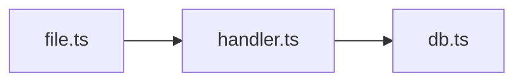

# Code Review

## Argument Router

| Input | Mode | Target |
|---|---|---|
| `init` | init | - |
| `init --update` | init-update | - |
| *(no args)* | auto | - |
| `staged` | staged | - |
| `unstaged` | unstaged | - |
| `branch` / `branch <name>` | branch | HEAD or `<name>` |
| `<PR#>` or `<PR URL>` | pr | `<PR#>` or `<URL>` |
| `<commit SHA>` | commit | `<SHA>` |
| `<SHA>..<SHA>` | commit | `<range>` |
| `<file path>` | file | `<path>` |
| `<directory>` | dir | `<path>` |
| `feedback` | feedback | show learned patterns from `feedback.jsonl` |
| `history` | history | show recent reviews from `review-history.jsonl` |

---

## MANDATORY: Init Check (runs FIRST, every time)

Before doing ANYTHING else - before parsing arguments, before any review - check if `project-profile.md` exists in this skill's directory.

**If it does NOT exist**, STOP and tell the user:

> This project hasn't been initialized yet. Run `/review init` first to set up your project profile and tech-specific references. This only takes a minute and makes every future review significantly better.

Do NOT proceed with any review mode. Do NOT offer to skip init. The only allowed actions without a profile are `init` and `init --update`.

**If it exists**, proceed normally.

---

## Tone Rules (apply to ALL modes)

- No compliments, filler phrases, or positive padding ("solid", "clean", "great", "nice", "looks good")
- Direct, specific, concise - senior engineer talking to a peer
- Every sentence delivers information or asks a question - nothing else
- Never output the em dash character (the long unicode dash, U+2014). Always use the regular hyphen-minus.
- Short sentences. If a sentence has more than one comma-separated clause, split it.

---

# Init Flow

If mode is `init` or `init-update`, read and follow `init-flow.md` in this skill's directory.

---

# Review Flow

## Step 1: Prepare

Run the prep script to collect all deterministic context in one call:

```bash
python3 <skill-dir>/scripts/prep.py \
  --mode <mode> --target "<target>" --project-dir <project-root>
```

The script outputs: change summary, file clusters, risk factors, test gaps, suggested labels, profile context, diff command, reference files to read, learned patterns from feedback, previous review state.

Read the full output. If "No changes found", inform user and stop.

## Step 2: Get Diff and Source

1. Run the **diff command** from prep output
2. Read each **changed source file** in full (skip binary, lockfiles, generated code)
3. **MUST read every reference file** from the "Read These References" section of prep output. Resolve paths as `<skill-dir>/reference/<filename>`. Read each file in full using the Read tool.
   - **STOP**: Do NOT proceed to Step 3 until every listed reference file has been read. If a file is missing, note it and continue with the rest.
   - After reading, confirm to yourself: "Read N/N reference files." If the count doesn't match, go back and read the missing ones.
4. For file/dir mode: read target files directly

## Step 3: Run Analysis Tools

Each subsection below has an explicit trigger condition based on prep output. **If the trigger condition is met, you MUST run that tool.** Use the **Agent tool** to parallelize when multiple apply.

### Linters (when prep output contains "## Linters")

Run the detected linter against changed files. Parse the output and include findings.

| Linter | Command | Output |
|---|---|---|
| eslint | `npx eslint --format json <files>` | JSON array |
| biome | `npx biome check --reporter=json <files>` | JSON |
| ruff | `ruff check --output-format json <files>` | JSON array |
| prettier | `prettier --check <files>` | List of unformatted files |
| clippy | `cargo clippy --message-format=json 2>&1` | JSON lines (filter to changed files) |
| golangci-lint | `golangci-lint run --out-format json <files>` | JSON |
| rubocop | `rubocop --format json <files>` | JSON |

If the tool isn't installed or fails, skip it silently.

### Cross-File Impact (when prep output contains "## Cross-File Impact")

Use Grep to find files that import the changed modules:

```
For each changed source file, grep the project for import/require/use statements referencing it.
Report files that import changed modules but aren't in the changeset.
```

Skip `node_modules`, `.git`, `dist`, `build`, `target`, `vendor`, `__pycache__`.

### Dependency Vulnerabilities (when prep output contains "## Dependency Changes Detected")

Run the appropriate audit tool:

| Dep File | Command |
|---|---|
| package.json/lock | `npm audit --json` |
| Cargo.toml/lock | `cargo audit --json` |
| requirements.txt | `pip-audit --format json` |
| go.mod | `govulncheck -json ./...` |

If no audit tool available, skip with a note.

## Step 4: Analyse

### 4a. Change Walkthrough

Using file clusters and changed functions from prep output:
1. Write a 2-3 sentence summary of what changed and why
2. Group related files and describe each group's purpose in one line
3. If branch/PR mode and prep output contains "## Commit History": read the commit progression to understand the developer's intent and iteration order. Use this to:
   - Distinguish intentional design choices from oversights (e.g., a file refactored in commit 2 after being added in commit 1 - the final state is intentional)
   - Avoid flagging patterns that were deliberately introduced (commit message says "switch to X approach")
   - Identify when a later commit may have broken something that worked in an earlier commit

### 4b. Review Protocol

**For each changed file**, apply the following checks **in order**. Do not skip items - if a check has no findings for a file, move to the next check.

1. **Blocking patterns** - compare each change against every pattern in the "Blocking Patterns (from profile)" section of prep output. Any match is `[blocking]`.
2. **Priority focus areas** - apply extra scrutiny to changes touching areas listed in "Priority Focus (from profile)" section of prep output.
3. **Generated reference files** - for each finding you consider raising, check whether the reference files you read in Step 2 contain a relevant rule. Cite the reference if so.
4. **Linter findings** (if Step 3 produced them) - deduplicate against your own findings, promote genuine issues.
5. **Cross-file impact** (if Step 3 produced results) - flag dependents that import changed modules but are not in the changeset.
6. **Test coverage gaps** from prep "Test Coverage Gaps" section - suggest specific test cases.
7. **Dependency vulnerabilities** (if Step 3 produced results) - `[blocking]` if critical/high severity.
8. **Learned patterns** from prep "Learned Patterns" section - suppress previously dismissed findings, apply corrections the user has taught.
9. **Your own knowledge** of detected languages, frameworks, and their detected versions.

## Step 5: Validate Findings

**STOP: Do NOT present findings to the user, post to a PR, or proceed to Step 6 until validation is complete for every `[blocking]` and `[important]` finding.**

For each `[blocking]` or `[important]` finding:

1. If the finding came from a reference file → use the source link already in that file. Confirmed.
2. If no source link exists → search via `mcp__Ref__ref_search_documentation` or `mcp__Ref__ref_read_url` to verify the claim is correct for the detected version.
3. **Confirmed** → keep. Attach source link + fix snippet.
4. **Wrong/outdated** → drop silently. Do NOT include it in the report.
5. **Inconclusive** (cannot confirm or deny after searching) → keep with `(unverified)` marker.

**Validation is NOT required for**: missing await, null deref, unused vars, hardcoded secrets, linter-reported findings. These are self-evident from the code.

After validation, re-check: does the finding still apply given the full context of the change (commit history, surrounding code, other files in the changeset)? If not, drop it.

## Step 6: Report

Check report mode from prep output. **If mode is humanized, skip Standard Mode entirely - go directly to Humanized Mode below.** Do NOT read the Standard Mode template as a starting point for humanized output.

**For PR mode**: after generating the review, go to the "Deliver" subsection below to preview and post. Do NOT ask "want me to post?" - show the preview directly.

### Standard Mode

```
## Change Walkthrough
<2-3 sentence summary>

### File Groups
- **auth/** - Updated login flow (3 files)

## Issues Found

### [blocking]
1. **file.ts:42** - Description. Why it matters.
   ```ts
   // Fix
   <corrected code>
   ```
   Source: <URL>

### [important] / [nit] / [suggestion]
...

## Test Suggestions
- <specific test cases for uncovered changes>
```

Omit empty sections. Zero issues → "No issues found."

For complex changes (complexity > 0.5 or files > 5), include a Mermaid diagram:


### Humanized Mode

PR review comments must look fully human-written. Your team lead flagged AI-augmented PR comments as a "significant HITM guardrail anti-pattern." Humanized mode is NOT standard mode with labels removed - it is a completely different voice.

**NEVER use in humanized mode**:
- Section headers (`##`, `###`, or any markdown heading)
- Bullet lists or numbered lists
- Severity labels (`[blocking]`, `[important]`, `[nit]`)
- Code block fences for fix suggestions (use inline backticks only)
- Summary tables or structured formatting of any kind
- The em dash character (the long unicode dash, U+2014) - it looks drawn/AI-generated. Use the regular hyphen-minus only.
- Compliments, positive padding, or filler: "solid", "clean", "great", "nice", "looks good to ship", "no issues", "LGTM", "well done", "good job", "no security concerns"
- AI tells: "heads up", "nit:", "it's worth noting", "consider", "ensure", "I noticed that", "I'd suggest", "one thing to be aware of", "just worth knowing", "just be aware", "be aware", "worth a look", "worth noting", "is that the intent"
- Multi-clause compound sentences - keep sentences short, one or two per thought max

**ALWAYS in humanized mode**:
- Write in lowercase, casual prose. Short sentences. Paragraphs, not lists.
- Refer to code with inline backticks: `functionName`
- Ask questions naturally: "any reason to go with X here?"
- Combine related thoughts into the same paragraph - don't split related findings into separate comments
- Use the regular hyphen-minus character only. Never the long em dash (U+2014).
- Every sentence delivers information or asks a question. Nothing else.

**Example - WRONG** (AI tells, positive padding):

> solid addition for PII scrubbing. one thing to be aware of, the "auth" keyword will substring-match against "author". great for debugging user issues, just be aware it'll bump recording size. no blocking issues, clean typescript. looks good to ship.

**Example - RIGHT**:

> `BODY_DENY_KEYWORDS` has "auth" which substring-matches "author", "authority" etc - if you see over-redacted recordings later that's why. `PII_FIELDS` covers first/last name but not bare `name` so full names in a single field pass through unmasked. also `canvasFps: 4` in a logo editor means canvas frames in every recording - intentional? bumps recording size vs DOM-only.

**Example - WRONG** (structured, long, AI voice):

> ## Issues Found
> ### [blocking]
> 1. **auth.ts:42** - Missing input validation...

**Example - RIGHT**:

> auth.ts around line 42 - user input goes straight into the query without validation, sql injection risk. wrapping it in `sanitizeInput()` fixes it. the retry logic in `fetchData` doesn't backoff either so if upstream is down you'll hammer it.

Zero issues → "looks clean, nothing jumped out."

**PR mode**: do NOT output the review text here. Generate it internally, then go to Deliver below where it will be shown as the preview with file:line targets. The preview IS the review - showing it twice is redundant.

### Deliver

**All non-PR modes**: the report shown above IS the delivery. Skip to Step 7.

**PR mode with `Offer PR posting: no`** (or field missing): show the review in conversation only. Skip to Step 7.

**PR mode with `Offer PR posting: yes`**: preview, confirm, then post. **The preview IS the review** - do NOT show a separate prose review before the preview. Go straight to showing the inline comments or single comment body below.

**1. Resolve format**: Check the profile's `Posting format` field. If it specifies `single` or `inline`, use that - do NOT ask the user again. Only ask if the field is missing or empty:

> Post to PR? Choose format:
> 1. Single comment - full review as one summary
> 2. Inline comments - each finding on the relevant line
> 3. Skip - don't post

**2. Redact secrets**: Before previewing or posting, scan all comment text for patterns matching secrets (API keys, tokens, passwords, connection strings, private keys, `.env` values). Replace any detected secret with `[REDACTED]`.

**3. Preview (MANDATORY - do NOT ask "want me to post?" without showing what will be posted)**:

For **inline mode in humanized report**, present each comment as a separate humanized prose snippet with its file:line target. Each comment is independent - do not write one big block and split it later. Write each comment individually:

```
**posthog-network-scrubber.ts:30**
> `BODY_DENY_KEYWORDS` has "auth" which substring-matches "author", "authority" etc - if you see over-redacted recordings that's why.

**posthog-network-scrubber.ts:49**
> `PII_FIELDS` has first/last name but not bare `name` - full names in a single field pass through.
```

For **single comment mode**, show the full comment body.

The user MUST see exactly what will appear on GitHub before any posting happens. Combine related findings into one comment where they touch the same concern.

**4. Confirm**: Ask: "post these? (yes / edit / skip)"

**STOP: WAIT for user confirmation before posting anything.**

**5. Post** based on resolved format:
- **Single comment**: `gh pr review <PR#> --comment --body "..."`
- **Inline comments**: post each finding individually via `gh api repos/{owner}/{repo}/pulls/{pr}/comments --method POST -f body="<finding>" -f path="<file>" -f commit_id="$(gh pr view <PR#> --json headRefOid -q .headRefOid)" -F line=<line>`. One comment per API call.
- **Skip**: do nothing

**6. Apply labels** (only if posting was done): `gh pr edit <PR#> --add-label "<labels>"` using suggested labels from prep output.

## Step 7: Apply Fixes (Optional)

After the report (and after posting if PR mode), offer to apply fixes **only if there are actionable findings**. If there are zero findings, skip directly to Step 8.

In humanized mode: "want me to fix any of these?"
In standard mode: "Apply fixes? (all, #1 #3, or skip)"

Use Edit to apply directly.

**STOP: WAIT for the user's response before proceeding to Step 8.** Do NOT combine this prompt with the feedback prompt. Handle the user's fix request (or skip) completely before moving on.

## Step 8: Record

### Save review state (for incremental reviews next time)

For PR/branch modes, update `review-state.json` in the skill directory.

Entry format:
```json
{"<mode>/<target>": {"last_reviewed_sha": "<HEAD>", "last_review_date": "<ISO8601>", "findings_count": N, "previous_findings": ["summary1", "summary2"]}}
```

**CRITICAL: MUST use Read then Edit, NOT Write.** The file contains entries from previous reviews of other branches/PRs. Using Write destroys all previous review state.

Steps:
1. **Read** `review-state.json` with the Read tool first.
2. If the file does NOT exist, create it with Write containing only the new entry.
3. If the file DOES exist, use **Edit** (not Write) to add/update the entry for `<mode>/<target>`, preserving ALL other entries.
4. **NEVER use Write on an existing review-state.json** - this has caused data loss of previous review entries.

### Log to history

Append one JSON line to `review-history.jsonl` in the skill directory:

```json
{"timestamp": "<ISO8601>", "mode": "<mode>", "target": "<target>", "files_changed": N, "findings": {"blocking": N, "important": N, "nit": N, "suggestion": N}}
```

### Collect feedback

After Step 7 is complete (fix application handled or skipped), ask:

> Dismiss any findings? (# to dismiss, or skip)

**STOP: WAIT for the user's response.** Do NOT combine this prompt with the delivery/posting prompt. Process dismissals before ending.

For each dismissed finding, append to `feedback.jsonl` in the skill directory:

```json
{"id": "<uuid>", "timestamp": "<ISO8601>", "type": "dismiss", "finding": "<description>", "file_pattern": "<*.ext>", "reason": "<user explanation>"}
```

