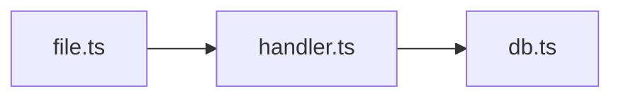

# Code Review

## Argument Router

| Input | Mode | Target |
|---|---|---|
| `init` | init | — |
| `init --update` | init-update | — |
| *(no args)* | auto | — |
| `staged` | staged | — |
| `unstaged` | unstaged | — |
| `branch` / `branch <name>` | branch | HEAD or `<name>` |
| `<PR#>` or `<PR URL>` | pr | `<PR#>` or `<URL>` |
| `<commit SHA>` | commit | `<SHA>` |
| `<SHA>..<SHA>` | commit | `<range>` |
| `<file path>` | file | `<path>` |
| `<directory>` | dir | `<path>` |
| `feedback` | feedback | show learned patterns from `feedback.jsonl` |
| `history` | history | show recent reviews from `review-history.jsonl` |

**Before Review Flow**: if `project-profile.md` doesn't exist in this skill's directory, inform user and auto-trigger Init Flow.

---

## Tone Rules

- No compliments, filler phrases, or positive padding
- Direct, specific, concise — senior engineer talking to a peer
- Every sentence delivers information or asks a question — nothing else

---

# Init Flow

If mode is `init` or `init-update`, read and follow `init-flow.md` in this skill's directory.

---

# Review Flow

## Step 1: Prepare

Run the prep script to collect all deterministic context in one call:

```bash
python <skill-dir>/scripts/prep.py \
  --mode <mode> --target "<target>" --project-dir <project-root>
```

The script outputs: change summary, file clusters, risk factors, test gaps, suggested labels, profile context, diff command, reference files to read, learned patterns from feedback, previous review state.

Read the full output. If "No changes found", inform user and stop.

## Step 2: Get Diff and Source

1. Run the **diff command** from prep output
2. Read each **changed source file** in full (skip binary, lockfiles, generated code)
3. Read any **reference files** listed in prep output
4. For file/dir mode: read target files directly

## Step 3: Run Analysis Tools

Based on prep output, run these **only when relevant**. Use the **Agent tool** to parallelize when multiple apply.

### Linters (when prep shows "Available Linters")

Run the detected linter against changed files. Parse the output and include findings.

| Linter | Command | Output |
|---|---|---|
| eslint | `npx eslint --format json <files>` | JSON array |
| biome | `npx biome check --reporter=json <files>` | JSON |
| ruff | `ruff check --output-format json <files>` | JSON array |
| prettier | `prettier --check <files>` | List of unformatted files |
| clippy | `cargo clippy --message-format=json 2>&1` | JSON lines (filter to changed files) |
| golangci-lint | `golangci-lint run --out-format json <files>` | JSON |
| rubocop | `rubocop --format json <files>` | JSON |

If the tool isn't installed or fails, skip it silently.

### Cross-File Impact (when >2 source files changed in branch/pr/commit mode)

Use Grep to find files that import the changed modules:

```
For each changed source file, grep the project for import/require/use statements referencing it.
Report files that import changed modules but aren't in the changeset.
```

Skip `node_modules`, `.git`, `dist`, `build`, `target`, `vendor`, `__pycache__`.

### Dependency Vulnerabilities (when prep shows "Dependency Changes Detected")

Run the appropriate audit tool:

| Dep File | Command |
|---|---|
| package.json/lock | `npm audit --json` |
| Cargo.toml/lock | `cargo audit --json` |
| requirements.txt | `pip-audit --format json` |
| go.mod | `govulncheck -json ./...` |

If no audit tool available, skip with a note.

## Step 4: Analyse

### 4a. Change Walkthrough

Using file clusters and changed functions from prep output:
1. Write a 2-3 sentence summary of what changed and why
2. Group related files and describe each group's purpose in one line
3. If branch/PR mode, use commit history to contextualize intent

### 4b. Review

Review every change against:

1. **Blocking patterns** from profile → always `[blocking]`
2. **Priority focus areas** from profile → extra scrutiny
3. **Generated reference files** → project-specific patterns
4. **Linter findings** (if run) → deduplicate, promote genuine issues
5. **Cross-file impact** (if checked) → flag broken dependents
6. **Test coverage gaps** from prep → suggest specific tests
7. **Dependency vulnerabilities** (if checked) → `[blocking]` if critical/high
8. **Learned patterns** from feedback → suppress dismissed, apply corrections
9. **Your own knowledge** of detected languages, frameworks, versions

## Step 5: Validate Findings

**Mandatory for `[blocking]` and `[important]` findings.**

1. If finding came from a reference file → use the source link already there
2. If no source link → verify via `mcp__Ref__ref_search_documentation` or `WebSearch`
3. **Confirmed** → keep with source link + fix snippet
4. **Wrong/outdated** → drop silently
5. **Inconclusive** → keep with `(unverified)` marker

Skip validation for: missing await, null deref, unused vars, hardcoded secrets, linter findings.

## Step 6: Report

Check report mode from prep output.

### Standard Mode

```
## Change Walkthrough
<2-3 sentence summary>

### File Groups
- **auth/** — Updated login flow (3 files)

## Issues Found

### [blocking]
1. **file.ts:42** — Description. Why it matters.
   ```ts
   // Fix
   <corrected code>
   ```
   Source: <URL>

### [important] / [nit] / [suggestion]
...

## Test Suggestions
- <specific test cases for uncovered changes>
```

Omit empty sections. Zero issues → "No issues found."

For complex changes (complexity > 0.5 or files > 5), include a Mermaid diagram:


### Humanized Mode

- Lowercase, casual tone. Short sentences.
- **No severity labels** — ever
- **No bullet lists or structured formatting**
- **No AI tells**: avoid "heads up", "nit:", "it's worth noting", "consider", "ensure", "I noticed that", "LGTM"
- Ask questions naturally: "any reason to go with X here?"

Zero issues → "looks clean, nothing jumped out."

## Step 7: Apply Fixes (Optional)

After the report, offer to apply fixes:

> Apply fixes? (all, #1 #3, or skip)

Use Edit to apply directly. In humanized mode: "want me to fix these?"

## Step 8: Record

### Save review state (for incremental reviews next time)

For PR/branch modes, write to `review-state.json` in the skill directory:

```json
{"<mode>/<target>": {"last_reviewed_sha": "<HEAD>", "last_review_date": "<ISO8601>", "findings_count": N, "previous_findings": ["summary1", "summary2"]}}
```

Read existing file first, merge the new entry, write back.

### Log to history

Append one JSON line to `review-history.jsonl` in the skill directory:

```json
{"timestamp": "<ISO8601>", "mode": "<mode>", "target": "<target>", "files_changed": N, "findings": {"blocking": N, "important": N, "nit": N, "suggestion": N}}
```

### Collect feedback

After delivery, ask:

> Dismiss any findings? (# to dismiss, or skip)

For each dismissed finding, append to `feedback.jsonl` in the skill directory:

```json
{"id": "<uuid>", "timestamp": "<ISO8601>", "type": "dismiss", "finding": "<description>", "file_pattern": "<*.ext>", "reason": "<user explanation>"}
```

### Deliver

**PR mode** — show preview first, wait for confirmation.

If profile has `Offer PR posting: yes`:
- **Standard** → `gh pr review <PR#> --comment --body "..."`
- **Humanized** → inline comments: `gh api repos/{owner}/{repo}/pulls/{pr}/comments`

Apply suggested labels if posting: `gh pr edit <PR#> --add-label "<labels>"`

**All other modes** — present report in conversation.
